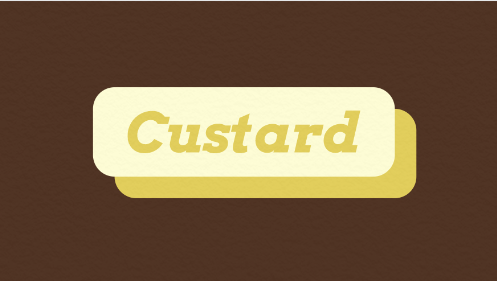
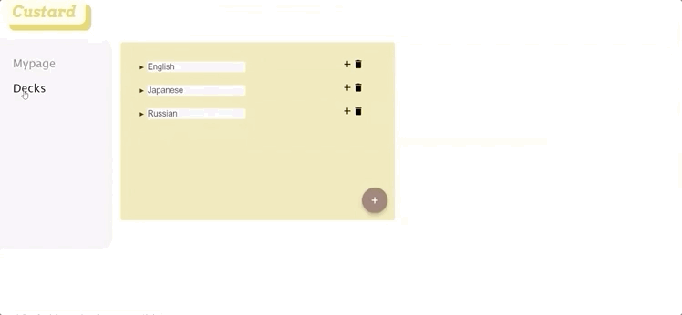
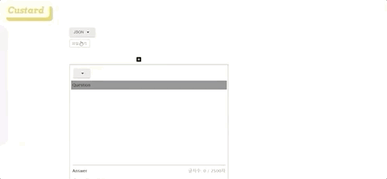
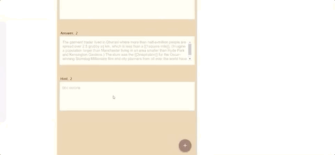

# 팀명: Andamiro 🙏
### 팀 소개
[Front-End]
* (팀장) 이민경
* 홍영란

[Back-End]
* 김정수
* 박성용

***
# 프로젝트명: Custard 🍮
 

## 프로젝트 정보
### 0. 소개
미드, 단어장, 전공서적, 신문 기사, 어떤 정보든 나만의 교재로 만드는 커스텀 플래시카드 웹 어플리케이션입니다.

※ 배포 링크 :  http://custard-client.s3-website.ap-northeast-2.amazonaws.com/

### 1. 설치 및 사용 방법

(1) 코드 복사

> 본 레파지토리를 https://github.com/YounglanHong/FinalProject_Custard.git 주소를 활용하여 로컬 환경에 clone 합니다. 
```
git clone https://github.com/YounglanHong/FinalProject_Custard.git
```
(2) 패키지 설치
```
npm install
```
(3) 실행
```
// Custard-client 
cd client
npm start

// Custard-server
npm start
```
### 2. 디렉토리 구조
* Custard-client
```
├── src/
     └── components/
     |    ├──  Login/                      
     |    ├──  Signup/                
     |    ├──  Mypage/                     
     |    ├──  AllDeckList/                     
     |    ├──  Deck/                 
     |    ├──  Card/                   
     |    ├──  AddCard/                      
     |    ├──  Blank/                         
     |    ├──  Flashcard/                       
     |    ├──  Study/                   
     |    ├──  Score/                   
     |    └── root/       
     |         ├──  LoginRoot/   
     |         ├──  SignupRoot/ 
     |         └──  MypageRoot/    
     |    └──  selectMenu/               - menu list 기능
     |    └──  speedDial/                - speed dial 기능
     |    └──  textType/                 - AddCard에 필요한 함수들
     |
     ├── containers/
     |    ├──  Login/                      
     |    ├──  Signup/                
     |    ├──  Mypage/                     
     |    ├──  AllDeckList/                     
     |    ├──  Deck/                             
     |    ├──  AddCard/                      
     |    ├──  Blank/                         
     |    ├──  Flashcard/                       
     |    ├──  Study/                   
     |    └──  Score/                      
     |
     ├── actions/
     |    ├── allDeckListActions/                
     |    ├── cardActions/                       
     |    └── myPageActions/                 
     |
     ├── reducers/
     |    ├── cardReducer/                
     |    ├── deckReducer/               
     |    ├── mypageReducer/                           
     |    └── rootReducer/                 
     |
     ├── styles/                     - 주요 component css 파일
     ├── App                             
     ├── App.css                          
     └── index                            
```
* Custard-server
```
└── controller/
     └── cards/
     |    ├──  index/                      
     |    ├──  card/                
     |    ├──  hinted/                     
     |    ├──  marked/                     
     |    ├──  update_card/                 
     |    ├──  correct/                             
     |    └──  wrong/       
     └── decks/
     |    ├──  category/                      
     |    ├──  deck/                
     |    ├──  index/                     
     |    ├──  update_cate/                                              
     |    └──  update_deck/   
     └── user/
     |    ├──  index/                      
     |    ├──  login/                
     |    ├──  profile/                     
     |    ├──  signout/                                              
     |    └──  signup/ 
     |
     ├── index/
     |
     ├── models/
     |    ├──  index/   
     |    ├──  Card/                      
     |    ├──  Category/                
     |    ├──  Deck/                     
     |    ├──  User/                                      
     |    └──  Like/                      
     |
     ├── routes/
     |    ├── cards/                
     |    ├── decks/                       
     |    └── users/                 
     |                          
     └── app                          
```

### 3. 주요 기능 
* 구글 소셜 로그인 & 프로필 이미지 추가


* category & deck 추가/삭제



* 텍스트 타입 별 카드 추가
  - 일반 텍스트 
   
  
  - 표 형식  
   
 
  - JSON 형식  
   
 
  - 이미지 텍스트 인식  
   
   
  
* 카드 학습 & 점수보기  


  
### 4. 사용 스택
#### Front-End
* React & Redux
* TOAST-UI
* Tesseract.js
* Material-UI

#### Back-End
* Node.js & Express
* JWT
* MySQl
* Sequelize

#### Deployment
* AWS - S3
* AWS - EC2
* AWS - RDS

***


